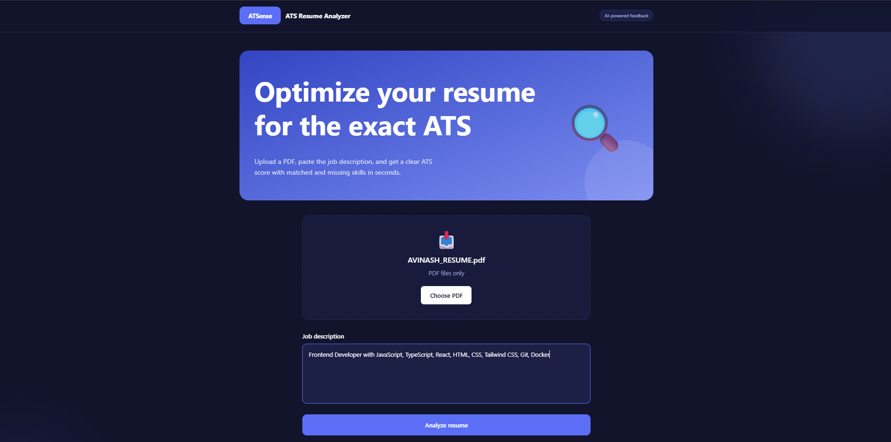
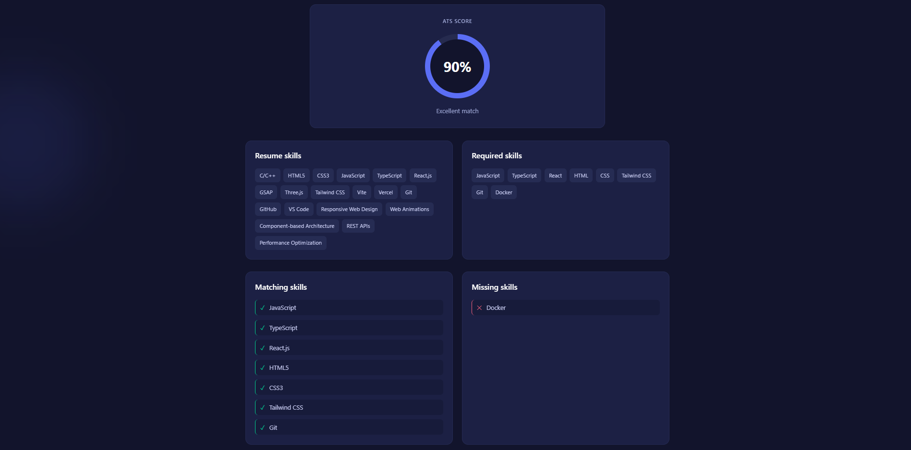
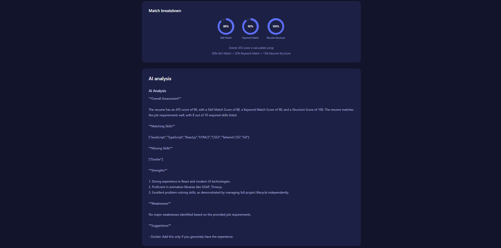

# ATSense — AI Resume Analyzer

> An AI-powered resume analysis platform that evaluates resumes against job descriptions, calculates an ATS compatibility score, identifies matching and missing skills, and provides actionable AI-generated feedback.

---

## Overview

**ATSense** is a full-stack AI Resume Analyzer built to help job seekers understand how well their resume matches a specific job description.

The application combines deterministic resume analysis with local AI processing to provide:

- ATS compatibility scoring
- Resume skill extraction
- Job-description skill extraction
- Matching skill detection
- Missing skill detection
- Resume structure analysis
- Keyword matching
- AI-generated strengths and weaknesses
- Actionable resume suggestions

The AI processing runs locally using **Ollama and Llama 3.2 3B**, avoiding dependency on paid cloud AI APIs.

---

## Screenshots

### Resume Upload

Upload a PDF resume and provide the target job description.



### ATS Score & Skill Matching

The analyzer generates an ATS score and clearly separates matching and missing skills.



### AI-Powered Resume Analysis

The system generates a detailed analysis covering strengths, weaknesses, and suggestions.



---

## Key Features

### Resume Processing

- PDF resume upload
- PDF text extraction
- PDF-only file validation
- Automatic resume content analysis

### AI-Powered Skill Extraction

- Extracts technical skills from resumes
- Extracts required skills from job descriptions
- Uses local LLM processing through Ollama
- Prevents unsupported skill inference
- Handles duplicate skills

### Skill Matching

The system compares resume skills against job requirements using normalized skill names.

Examples:

```text
React.js  → React
ReactJS   → React
HTML5     → HTML
CSS3      → CSS
NodeJS    → Node.js
Mongo DB  → MongoDB

```
---

## How to Run

Follow the steps below to run ATSense on a Windows computer.

### Prerequisites

Make sure the following software is installed:

- Git
- Node.js 20 or later
- Docker Desktop
- Ollama

Verify the installations:

```powershell
git --version
node --version
docker --version
ollama --version
```
### 1. Clone the Repository

```powershell
git clone https://github.com/avinash17x/Internship-Project.git
cd Internship-Project
```

### 2. Install the Ollama Model

ATSense uses **Llama 3.2 3B** through Ollama.

```powershell
ollama pull llama3.2:3b
ollama list
```

Make sure `llama3.2:3b` appears in the list.

### 3. Start Ollama

Open **Terminal 1**:

```powershell
$env:OLLAMA_HOST="0.0.0.0:11434"
ollama serve
```

Keep this terminal running.

Ollama runs at:

```text
http://localhost:11434
```

### 4. Build and Start the Backend

Open **Terminal 2**:

```powershell
cd Internship-Project
docker build -t ai-resume-backend ./Backend
docker run --rm -p 5000:5000 -e OLLAMA_URL=http://host.docker.internal:11434 ai-resume-backend
```

Backend runs at:

```text
http://localhost:5000
```

Keep this terminal running.

### 5. Start the Frontend

Open **Terminal 3**:

```powershell
cd Internship-Project\Frontend\frontend
npm install
npm run dev
```

Open the frontend at:

```text
http://localhost:5173
```

### 6. Run the Application

Once all three services are running, open:

```text
http://localhost:5173
```

Upload a **PDF resume**, enter the **job description**, and start the analysis.
